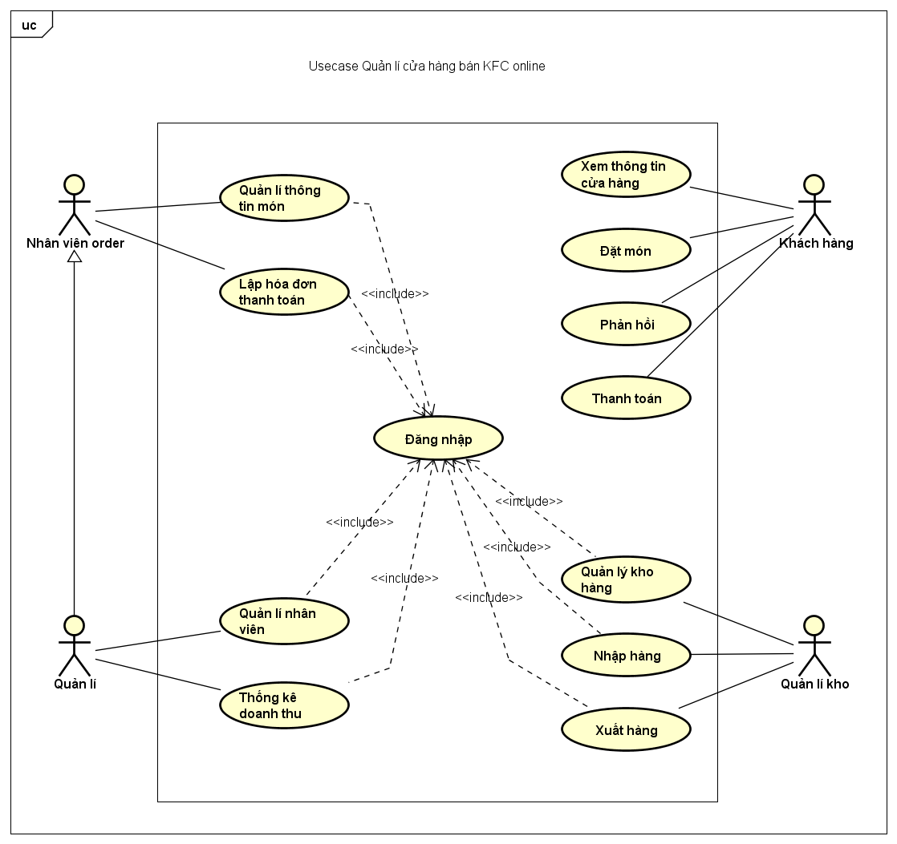
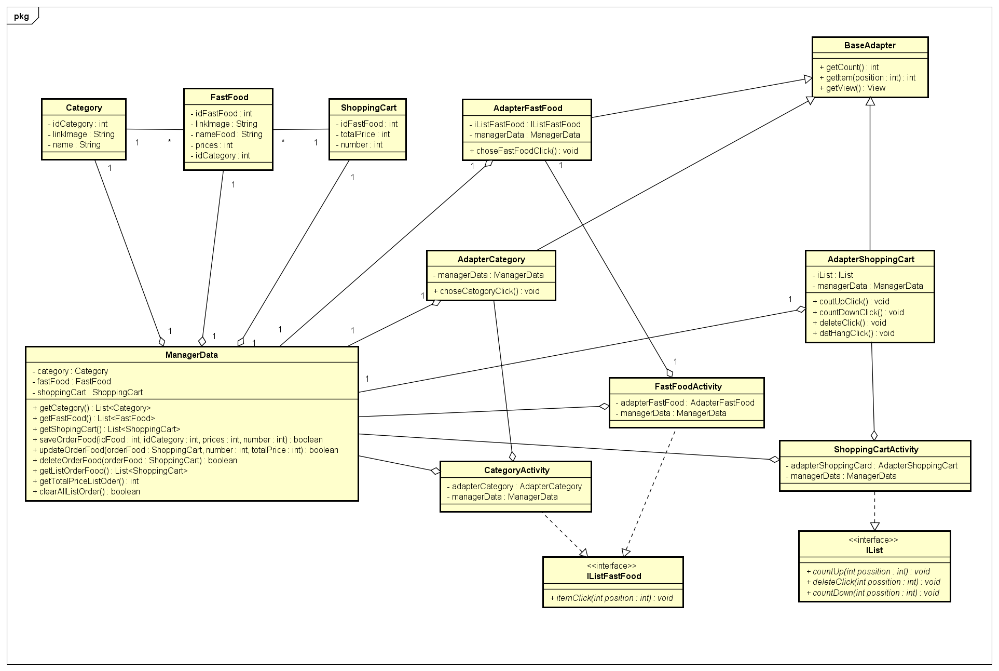
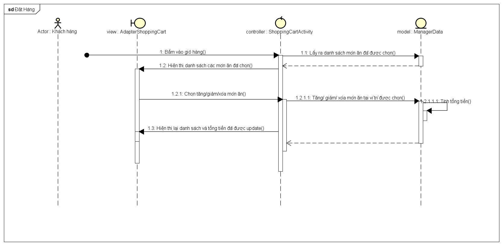
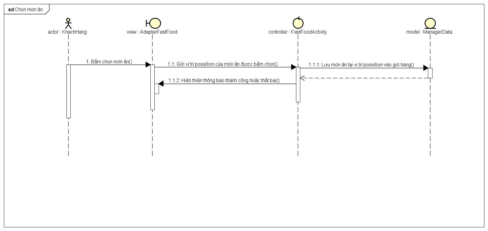
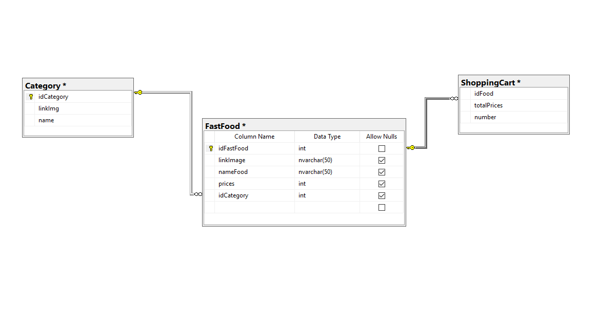
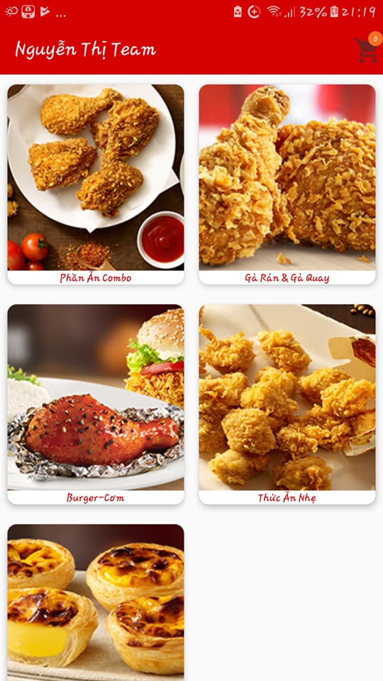
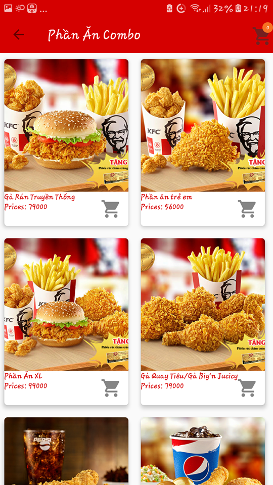
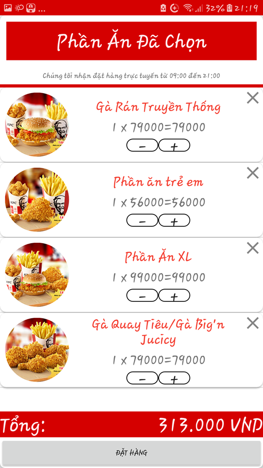

I. Biểu đồ usecase:
===================

II. Đặc tả chi tiết:
====================

2.1. UC “Đặt món”:
------------------

| Tên ca sử dụng: Đặt món                                                                                                                                                                                        | Mã usecase: UC001                      | Tầm quan trọng: Cao |
|----------------------------------------------------------------------------------------------------------------------------------------------------------------------------------------------------------------|----------------------------------------|---------------------|
| Actor: Khách hàng                                                                                                                                                                                              | Loại ca sử dụng: Chi tiết và thiết yếu |                     |
| Người tham gia và mối quan tâm:                                                                                                                                                                                |                                        |                     |
| Mô tả ngắn gọn: Ca sử dụng này mô tả cách khách hàng có thể đặt món trên web như thế nào                                                                                                                       |                                        |                     |
| Kích hoạt: Khách hàng truy cập hệ thống và đặt món hoặc hủy đặt món                                                                                                                                            |                                        |                     |
| Mối quan hệ:                                                                                                                                                                                                   |                                        |                     |
| Luồng sự kiện chính:                                                                                                                                                                                           |                                        |                     |
| Luồng sự kiện con: 5.1. Hủy món ăn:                                                                                                                                                                            |                                        |                     |
| Luồng ngoại lệ: 4a-1. Khách hàng gửi đến một yêu cầu tìm kiếm mới. 4a-2. Khách hàng lặp đi lặp lại trong các bước từ 2 đến 4 cho đến khi hài lòng với kết quả tìm kiếm hoặc từ bỏ. 7a. Khách hàng hủy bỏ lệnh. |                                        |                     |
|                                                                                                                                                                                                                |                                        |                     |
|                                                                                                                                                                                                                |                                        |                     |

-   Khách hàng: muốn đặt món hoặc hủy order

-   Nhân viên order: tối đa hóa sự hài lòng của khách hàng.

-   Mối liên quan: Khách hàng

-   Bao gồm: Thanh toán.

1.  Khách hàng tương tác gửi yêu cầu vào hệ thống

2.  Hệ thống cung cấp cho Khách hàng một danh mục đồ ăn( phần ăn combo, gà rán &
    gà quay, hamburger- cơm, thức ăn nhẹ, tráng miệng và thức uống)

3.  Khách hàng chọn một trong các danh mục để tìm hiểu thêm thông tin các món.

4.  Khách hàng chọn một món trong các món để thêm vào giỏ hàng của mình.

5.  Khách hàng tiếp tục duy trì việc đặt món cho đơn hàng.

6.  Khách hàng lặp đi lặp lại từ 3 đến 5 cho đến khi thực hiện mua sắm.

7.  Khách hàng thực hiện trường hợp sử dụng thanh toán.

8.  Khách hàng rời khỏi trang Web

-   Khách hàng lựa chọn món ăn cần hủy đặt

-   Hệ thống xác nhận món ăn khách hàng cần hủy và gửi lại lệnh yêu cầu xác nhận
    hủy món.

-   Khách hàng xác nhận và hủy món.

5.2. Thay đổi số lượng món ăn:

-   Khách hàng lựa chọn món ăn cần thay đổi số lượng.

-   Hệ thống xác nhận món ăn khách hàng cần thêm.

-   Khách hàng thêm hoặc giảm số lượng món ăn.

2.2. UC “Thanh toán”:
---------------------

| Tên ca sử dụng: Thanh toán                                                             | Mã usecase: UC002                    | Tầm quan trọng: Cao |
|----------------------------------------------------------------------------------------|--------------------------------------|---------------------|
| Actor:Khách hàng                                                                       | Loại ca sử dụng: Chi tiết, thiết yếu |                     |
| Người tham gia và mối quan tâm:                                                        |                                      |                     |
| Mô tả ngắn gọn: mô tả việc thanh toán đơn hàng của khách hàng                          |                                      |                     |
| Kích hoạt: Khách hàng đưa ra tín hiệu hệ thống họ muốn hoàn thành đơn đặt hàng của họ. |                                      |                     |
| Mối quan hệ:                                                                           |                                      |                     |
| Luồng sự kiện chính:                                                                   |                                      |                     |
| Luồng sự kiện con: 3.1. Hủy hình thức thanh toán:                                      |                                      |                     |
| Luồng ngoại lệ: 4.1.                                                                   |                                      |                     |
|                                                                                        |                                      |                     |
|                                                                                        |                                      |                     |

-   Khách hàng: muốn kết thúc việc đặt món.

-   Nhân viên Order: đưa ra hình thức thanh toán đơn hàng.

-   Mối liên quan:

-   Bao gồm:.

1.  Khách hàng nhấn thanh toán để tạo đơn hàng.

2.  Hệ thống hiển thị Form hóa đơn, đơn hàng.

3.  Khách hàng nhập thông tin: họ và tên, địa chỉ, thời gian giao hàng, email,
    phương thức thanh toán.

4.  Chọn gửi đơn hàng. Nếu đơn hàng nhập đúng, tiếp tục B5. Nếu sai thực hiện
    luồng ngoại lệ.

5.  Hệ thống xác nhận thông tin khách hàng và phương thức thanh toán. Nếu đúng
    thực hiện B6. Nếu sai thực hiện luồng ngoại lệ.

6.  Hệ thống thông báo giao dịch thành công.

7.  Kết thúc.

-   Hệ thống gửi thông báo xác nhận khách hàng có muốn hủy thanh toán hay không.

-   Khách hàng xác nhận yêu cầu.

-   Hệ thống báo hủy giao dịch thành công.

-   Hệ thống thông báo việc tạo đơn hàng không thành công.

-   Hệ thống hiển thị lại form nhập thông tin và báo các trường hợp nhập sai.

-   Khách hàng nhập lại thông tin, nếu muốn ngưng giao dịch thực hiện luồng sự
    kiện con.

-   Quay lại bước 4 luồng sự kiện chính.

6.1. Nếu khách hàng chọn hình thức thanh toán qua thẻ và hệ thống xác nhận thông
tin không hợp lệ:

-   Hệ thống thông báo phương thức thanh toán và tài khoản của khách hàng không
    hợp lệ.

-   Khách hàng nhập lại thông tin nếu muốn tiếp tục giao dịch. Ngưng giao dịch
    thực hiện luồng sự kiện con.

-   Quay lại bước 4 luồng sự kiện chính.

2.3. UC “Xem thông tin cửa hàng”:
---------------------------------

| Tên ca sử dụng: Xem thông tin cửa hàng                                          | Mã usecase: UC003                     | Tầm quan trọng: Cao |
|---------------------------------------------------------------------------------|---------------------------------------|---------------------|
| Actor: Khách hàng                                                               | Loại ca sử dụng: Chi tiết, khái quát. |                     |
| Người tham gia và mối quan tâm:                                                 |                                       |                     |
| Mô tả ngắn gọn: cho phép khách hàng xem thông tin về các món ăn trong cửa hàng. |                                       |                     |
| Kích hoạt: Khi người sử dụng truy cập vào website rồi chọn bất kỳ sản phẩm nào. |                                       |                     |
| Mối quan hệ:                                                                    |                                       |                     |
| Luồng sự kiện chính:                                                            |                                       |                     |
| Luồng sự kiện con: Không                                                        |                                       |                     |
| Luồng ngoại lệ:                                                                 |                                       |                     |
|                                                                                 |                                       |                     |
|                                                                                 |                                       |                     |

-   Khách hàng

-   Liên kết:

-   Mở rộng:

-   Bao hàm

-   Khái quát hóa:

1.  Khách hàng chọn sản phẩm cần xem thông tin

2.  Form xem thông tin sản phẩm xuất hiện, hệ thống hiển thị thông tin về món ăn
    đã chọn.

3.  Khách hàng xem thông tin chi tiết về món ăn.

-   1a : Sản phẩm đã bị xóa thì thông báo ra màn hình

2.4. UC “Lập hóa đơn thanh toán”:
---------------------------------

| Tên ca sử dụng: Lập hóa đơn thanh toán                                                                | Mã usecase: UC004                    | Tầm quan trọng: Cao |
|-------------------------------------------------------------------------------------------------------|--------------------------------------|---------------------|
| Actor: Nhân viên Order                                                                                | Loại ca sử dụng: Chi tiết, khái quát |                     |
| Người tham gia và mối quan tâm:                                                                       |                                      |                     |
| Mô tả ngắn gọn: Ca sử dụng này cho phép nhân viên order lập hóa đơn các món ăn khách hàng yêu cầu.    |                                      |                     |
| Kích hoạt: Nhân viên order chọn lập hóa đơn cho thông tin chi tiết cho từng món ăn do khách hàng đặt. |                                      |                     |
| Mối quan hệ:                                                                                          |                                      |                     |
| Luồng sự kiện chính:                                                                                  |                                      |                     |
| Luồng sự kiện con:                                                                                    |                                      |                     |
| Luồng ngoại lệ:                                                                                       |                                      |                     |
|                                                                                                       |                                      |                     |
|                                                                                                       |                                      |                     |

-   Nhân viên order: lập hóa đơn cho khách hàng

-   Khách hàng: đáp ứng các yêu cầu cơ bản cho việc lập hóa đơn

-   Mối liên quan:

-   Bao gồm:

1.  Hệ thống hiển thị lựa chọn: thêm ,in.

2.  Hệ thống liệt kê danh sách món ăn trong hóa đơn kèm thông tin về món ăn.

3.  Hệ thống yêu cầu công việc:

>   3.1. Nếu nhân viên chọn "thêm hóa đơn" ,luồng sự kiện con thêm hóa đơn được
>   thực hiện.

>   3.2. Nếu nhân viên chọn "in hóa đơn" ,luồng sự kiện con in hóa đơn được thực
>   hiện.

>   3.1. Thêm hóa đơn.

-   Nhân viên đưa một hóa đơn mới để khách đặt món.

-   Thông tin chi tiết về hóa đơn được thêm vào hệ thống.

>   3.2. In hóa đơn.

-   Hệ thống hiển thị hóa đơn.

-   Nhân viên chọn in hóa đơn và đưa cho khách.

2.5. UC “Đăng nhập”:
--------------------

| Tên ca sử dụng: Đăng nhập                                                                          | Mã usecase: UC005                    | Tầm quan trọng:Cao |
|----------------------------------------------------------------------------------------------------|--------------------------------------|--------------------|
| Actor: Nhân viên Order, Quản lý, Quản lý kho.                                                      | Loại ca sử dụng: Chi tiết, thiết yếu |                    |
| Người tham gia và mối quan tâm:                                                                    |                                      |                    |
| Mô tả ngắn gọn: Cách một người sử dụng đăng nhập vào hệ thống.                                     |                                      |                    |
| Kích hoạt: Ca sử dụng bắt đầu khi người sử dụng truy cập vào website rồi chọn chức năng đăng nhập. |                                      |                    |
| Mối quan hệ:                                                                                       |                                      |                    |
| Luồng sự kiện chính:                                                                               |                                      |                    |
| Luồng sự kiện con: không                                                                           |                                      |                    |
| Luồng ngoại lệ: 3.1. Luồng sự kiện A1: Nhập sai tài khoản / mật khẩu đăng nhập.                    |                                      |                    |
|                                                                                                    |                                      |                    |
|                                                                                                    |                                      |                    |

-   Nhân viên Order

-   Quản lý

-   Quản lý kho

-   Mối liên quan:

-   Bao gồm

1.  Hệ thống hiển thị giao diện đăng nhập.

2.  Hệ thống yêu cầu tác nhân đăng nhập và mật khẩu của mình.

3.  Hệ thống xác nhận tài khoản và mật khẩu có hợp lệ không,nếu không hợp lệ thì
    thực hiện luồng A1.

4.  Hệ thống ghi lại quá trình đăng nhập.

5.  Tác nhân đăng nhập thành công.

-   Hệ thống hiển thị lỗi.

-   Người sử dụng chọn đăng nhập lại hoặc hủy bỏ đăng nhập, khi đó ca sử dụng
    kết thúc.

2.6. UC “Quản lý thông tin món ăn”:
-----------------------------------

| Tên ca sử dụng: Quản lý thông tin món ăn                                                            | Mã usecase: UC006                  | Tầm quan trọng: Cao |
|-----------------------------------------------------------------------------------------------------|------------------------------------|---------------------|
| Actor: Nhân viên Order                                                                              | Loại ca sử dụng: Chi tiết, cụ thể. |                     |
| Người tham gia và mối quan tâm:                                                                     |                                    |                     |
| Mô tả ngắn gọn: Người dùng đăng nhập vào hệ thống quản trị để thực hiện các chức năng quản lý menu. |                                    |                     |
| Kích hoạt: người dùng đăng nhập và kiểm soát thông tin món ăn.                                      |                                    |                     |
| Mối quan hệ:                                                                                        |                                    |                     |
| Luồng sự kiện chính:                                                                                |                                    |                     |
| Luồng sự kiện con:                                                                                  |                                    |                     |
| Luồng ngoại lệ:                                                                                     |                                    |                     |
|                                                                                                     |                                    |                     |
|                                                                                                     |                                    |                     |

-   Nhân viên Order

-   Mối liên quan:

-   Bao gồm

1.  Trên giao diện quản trị hệ thống, người dùng chọn đăng nhập

2.  Hệ thống hiển thị giao diện đăng nhập, yêu cầu người dùng nhập Tài khoản và
    Mật khẩu

3.  Người sử dụng nhập Tài khoản và Mật khẩu, chọn đồng ý đăng nhập

4.  Hệ thống tiếp nhận thông tin, kiểm tra Tài khoản và Mật khẩu của người dùng

5.  Nếu hợp lệ, hệ thống chấp nhận đăng nhập, hiển thị thông báo đăng nhập thành
    công

6.  Thực hiện các chức năng quản lý món ăn của hệ thống: xem thông tin, thêm
    ,sửa ,xóa và tìm kiếm

2.7. UC “ Phản hồi”:
--------------------

| Tên ca sử dụng:Phản hồi                                                                                                    | Mã usecase: UC007                 | Độ ưu tiên : Trung bình |
|----------------------------------------------------------------------------------------------------------------------------|-----------------------------------|-------------------------|
| Tác nhân: Khách hàng                                                                                                       | Loại usecase: chi tiết, thiết yếu |                         |
| Người tham gia và mối quan tâm:                                                                                            |                                   |                         |
| Mô tả ngắn gọn: Cho phép khác hàng gửi những phản hồi về hệ thống hoặc sản phẩm                                            |                                   |                         |
| Kích hoạt: Khi khách hàng muốn gửi phản hồi lên hệ thống                                                                   |                                   |                         |
| Bao gồm: Mở rộng: Khái quát hóa:                                                                                           |                                   |                         |
| Luồng chính:                                                                                                               |                                   |                         |
| Luồng sự kiện con: không                                                                                                   |                                   |                         |
| Luồng ngoại lệ: 4a. Khách hàng chưa chọn mức độ hài lòng, hệ thống thông báo yêu cầu chọn mức độ hài lòng, quay lại bước 3 |                                   |                         |

-   Khách hàng

-   Gửi được phản hồi cho hệ thống

1.  Khách hàng chọn gửi phản hồi

2.  Hệ thống hiển thị giao diện gửi phản hồi

3.  Khách hàng chọn mức độ hài lòng, ghi chi tiết (nếu muốn) và chọn gửi

4.  Hệ thống kiểm tra thông tin

5.  Hệ thống thông báo gửi phản hồi thành công

2.8. UC “ Xuất hàng “:
----------------------

| Tên ca sử dụng:Xuất hàng                                                                                            | Mã usecase: UC008                 | Độ ưu tiên : Cao |
|---------------------------------------------------------------------------------------------------------------------|-----------------------------------|------------------|
| Tác nhân: Quản lý kho                                                                                               | Loại usecase: chi tiết, thiết yếu |                  |
| Người tham gia và mối quan tâm:                                                                                     |                                   |                  |
| Mô tả ngắn gọn: Cho phép nhân viên kho hàng xuất sản phẩm để giao hàng                                              |                                   |                  |
| Kích hoạt: Khi nhân viên kho xuất mặt hàng có trong kho                                                             |                                   |                  |
| Bao gồm: Mở rộng: Khái quát hóa:                                                                                    |                                   |                  |
| Luồng chính:                                                                                                        |                                   |                  |
| Luồng phụ: không                                                                                                    |                                   |                  |
| Luồng tương đương/ ngoại lệ: 6a. Thông tin không hợp lệ, hệ thống thông báo thông tin không hợp lệ, quay lại bước 5 |                                   |                  |

-   Quản lý kho

1.  Nhân viên kho hàng tìm kiếm sản phẩm trong đơn hàng (của nhân viên giao hàng
    đưa cho)

2.  Hệ thống hiển thị thông tin sản phẩm

3.  Nhân viên kho hàng chọn xuất kho

4.  Hệ thống hiển thị giao diện xuất kho

5.  Nhân viên kho hàng nhập thông tin (thông tin đơn hàng, lý do xuất kho, …) và
    chọn xuất kho

6.  Hệ thống kiểm tra thông tin

7.  Hệ thống xác nhận xuất kho thành công

8.  Hệ thống thay đổi tình trạng đơn hàng sang đang giao hàng

2.9. UC “ Nhập hàng”:
---------------------

| Tên ca sử dụng: Nhập hàng                                                                                           | Mã usecase: UC009                 | Độ ưu tiên : Cao |
|---------------------------------------------------------------------------------------------------------------------|-----------------------------------|------------------|
| Tác nhân: Nhân viên kho hàng                                                                                        | Loại usecase: chi tiết, thiết yếu |                  |
| Người tham gia và mối quan tâm:                                                                                     |                                   |                  |
| Mô tả ngắn gọn: Cho phép nhân viên kho hàng thêm sản phẩm vào kho                                                   |                                   |                  |
| Kích hoạt: Khi nhân viên kho nhập hàng vào trong kho                                                                |                                   |                  |
| Bao gồm: Mở rộng: Khái quát hóa:                                                                                    |                                   |                  |
| Luồng chính:                                                                                                        |                                   |                  |
| Luồng phụ:                                                                                                          |                                   |                  |
| Luồng tương đương/ ngoại lệ: 4a. Thông tin không hợp lệ, hệ thống thông báo thông tin không hợp lệ, quay lại bước 3 |                                   |                  |

-   Quản lý kho

1.  Nhân viên kho hàng chọn Thêm sản phẩm vào kho

2.  Hệ thống hiển thị giao diện thêm sản phẩm

3.  Nhân viên kho hàng điền các thông tin sản phẩm, số lượng và chọn thêm

4.  Hệ thống kiểm tra thông tin

5.  Hệ thống xác nhận thêm sản phẩm thành công

III. Mô hình cấu trúc:
======================

3.1. Biểu đồ lớp ca sử dụng “Đặt món”:
--------------------------------------

3.2. Đặc tả lớp CRC: 
---------------------

| ❖ Fronts                                                               |                             |                    |
|------------------------------------------------------------------------|-----------------------------|--------------------|
| Tên Class : Category                                                   | ID: 1                       | Loại: Cụ thể, miền |
| Miêu tả: Là lớp mô hình hóa theo bảng cho cơ sở dữ liệu bảng Category. | Ca sử dụng liên quan: UC001 |                    |
| Khả năng                                                               | Cộng tác                    |                    |
| Thuộc tính:                                                            |                             |                    |
| Các mối quan hệ:                                                       |                             |                    |

>   ● ManagerData

>   ❖ Back:

>   ● idCategory;

>   ● linkImage;

>   ● name;

>   Generalization (a-kind-of):

>   Aggregation (has-parts):

>   Other Association: FastFood

| ❖ Fronts                                                                  |                             |                    |
|---------------------------------------------------------------------------|-----------------------------|--------------------|
| Tên Class : ShoppingCart                                                  | ID: 2                       | Loại: Cụ thể, miền |
| Miêu tả: Là lớp mô hình hóa theo bảng cho cơ sở dữ liệu bảng ShoppingCart | Ca sử dụng liên quan: UC001 |                    |
| Khả năng                                                                  | Cộng tác                    |                    |
| Thuộc tính:                                                               |                             |                    |
| Các mối quan hệ:                                                          |                             |                    |

>   ● ManagerData

>   ❖ Back:

>   ● idFastFood

>   ● totalPrice

>   ● number(Số lượng của món ăn đó)

>   Generalization (a-kind-of):

>   Aggregation (has-parts):

>   Other Association:

| ❖ Fronts                                                              |                             |                    |
|-----------------------------------------------------------------------|-----------------------------|--------------------|
| Tên Class : FastFood                                                  | ID: 3                       | Loại: Cụ thể, miền |
| Miêu tả: Là lớp mô hình hóa theo bảng cho cơ sở dữ liệu bảng FastFood | Ca sử dụng liên quan: UC001 |                    |
| Khả năng                                                              | Cộng tác                    |                    |
| Thuộc tính:                                                           |                             |                    |
| Các mối quan hệ:                                                      |                             |                    |

>   ● ManagerData

>   ❖ Back:

>   ● idFastFood

>   ● linkImage

>   ● nameFood

>   ● idCategory

>   ● prices

>   Generalization (a-kind-of):

>   Aggregation (has-parts):

>   Other Association: ShoppingCart

| ❖ Fronts                                                                                           |                             |                    |
|----------------------------------------------------------------------------------------------------|-----------------------------|--------------------|
| Tên Class : ManagerData                                                                            | ID: 4                       | Loại: Cụ thể, miền |
| Miêu tả: Quản lý đối tượng Category, FastFood, ShopingCart,Truy xuất dữ liệu thêm sửa xóa,cập nhập | Ca sử dụng liên quan: UC001 |                    |
| Khả năng                                                                                           | Cộng tác                    |                    |
| Thuộc tính:                                                                                        |                             |                    |
| Các mối quan hệ:                                                                                   |                             |                    |

-   Trả về danh sách danh mục

-   Trả về danh sách món ăn theo một danh mục

-   Lấy ra một món ăn theo idFood và theo một danh mục

-   Lưu món ăn vào giỏi hàng

-   Update lại số lượng,tổng tiền của 1 món ăn trong giỏ hàng

-   Delete 1 món ăn trong giỏi hàng

-   Trả về danh sách giỏ hàng

-   Trả về tổng tiền của cả giỏ hàng

-   Clear danh sách order

-   CategoryActivity

-   FastFoodActivity

-   ShoppingCartActivity

-   FastFood

-   Category

-   ShoppingCart

>   ❖ Back:

>   ● fastFood

>   ● category

>   ● shoppingCart

>   Generalization (a-kind-of):

>   Aggregation (has-parts): Category; FastFood; ShoppingCart.

>   Other Association:

| ❖ Fronts                                                                |                             |                    |
|-------------------------------------------------------------------------|-----------------------------|--------------------|
| Tên Class : FastFoodActivity                                            | ID: 5                       | Loại: Cụ thể, miền |
| Miêu tả: Xử lí sự kiện người dùng đặt món ăn (chọn biểu tượng giỏ hàng) | Ca sử dụng liên quan: UC001 |                    |
| Khả năng                                                                | Cộng tác                    |                    |
| Thuộc tính:                                                             |                             |                    |
| Các mối quan hệ:                                                        |                             |                    |

-   AdapterFastFood

-   ManagerData

>   ❖ Back:

>   ● adapterFastFood

>   Generalization (a-kind-of):

>   Aggregation (has-parts): ManagerData; AdapterFastFood

>   Other Association: IList

| ❖ Fronts                    |                            |                    |
|-----------------------------|----------------------------|--------------------|
| Tên Class : AdapterCategory | ID: 6                      | Loại: Cụ thể, miền |
| Miêu tả:                    | Ca sử dụng liên quan:UC001 |                    |
| Khả năng                    | Cộng tác                   |                    |
| Thuộc tính:                 |                            |                    |
| Các mối quan hệ:            |                            |                    |

-   ManagerData

>   ❖ Back:

>   ● manegerData

>   Generalization (a-kind-of): BaseAdater

>   Aggregation (has-parts): CategoryActivity

>   Other Association

| ❖ Fronts                        |                             |                    |
|---------------------------------|-----------------------------|--------------------|
| Tên Class : AdapterShoppingCart | ID: 7                       | Loại: Cụ thể, miền |
| Miêu tả:                        | Ca sử dụng liên quan: UC001 |                    |
| Khả năng                        | Cộng tác                    |                    |
| Thuộc tính:                     |                             |                    |
| Các mối quan hệ:                |                             |                    |

-   ManagerData

>   ❖ Back:

-   iList

-   managerData

>   Generalization (a-kind-of): BaseAdater

>   Aggregation (has-parts): ShoppingCastActivity

>   Other Association:

| ❖ Fronts               |                            |                    |
|------------------------|----------------------------|--------------------|
| Tên Class : BaseAdater | ID: 8                      | Loại: Cụ thể, miền |
| Miêu tả:               | Ca sử dụng liên quan:UC001 |                    |
| Khả năng               | Cộng tác                   |                    |
| Thuộc tính:            |                            |                    |
| Các mối quan hệ:       |                            |                    |

-   Trả về số lượng phần tử trong một danh sách

-   Trả về đối tượng tại chỉ mục

-   Trả về view theo chỉ mục

>   ❖ Back:

>   Generalization (a-kind-of):

>   Aggregation (has-parts):

>   Other Association:

| ❖ Fronts                     |                            |                    |
|------------------------------|----------------------------|--------------------|
| Tên Class : CategoryActivity | ID: 9                      | Loại: Cụ thể, miền |
| Miêu tả:                     | Ca sử dụng liên quan:UC001 |                    |
| Khả năng                     | Cộng tác                   |                    |
| Thuộc tính:                  |                            |                    |
| Các mối quan hệ:             |                            |                    |

-   AdapterCategory

>   ❖ Back:

-   adapterCategory

>   Generalization (a-kind-of):

>   Aggregation (has-parts):

>   Other Association:

| ❖ Fronts                         |                             |                    |
|----------------------------------|-----------------------------|--------------------|
| Tên Class : ShoppingCartActivity | ID: 10                      | Loại: Cụ thể, miền |
| Miêu tả:                         | Ca sử dụng liên quan: UC001 |                    |
| Khả năng                         | Cộng tác                    |                    |
| Thuộc tính:                      |                             |                    |
| Các mối quan hệ:                 |                             |                    |

-   AdapterShoppingCart

>   ❖ Back:

-   adapterShoppingCard

>   Generalization (a-kind-of):

>   Aggregation (has-parts):

>   Other Association:

3.3. Sơ đồ trình tự:
--------------------

1.  **Trình tự “Đặt hàng”:**

1.  **Trình tự “Chọn món ăn”**

IV. Thiết kế phần mềm:
======================

4.1. Xây dựng cơ sở dữ liệu:
----------------------------

4.2. Hợp đồng thông điệp:
-------------------------

1.  **Phương thức “shoppingCart”:**

| Tên phương thức: shoppingCart()                                                                              | Tên lớp: FastFoodActivity | ID: HD01 |
|--------------------------------------------------------------------------------------------------------------|---------------------------|----------|
| Đối tượng gửi thông điệp: khách hàng                                                                         |                           |          |
| Ca sử dụng liên quan: UC001                                                                                  |                           |          |
| Mô tả trách nhiệm: thêm món ăn vào giỏ hàng                                                                  |                           |          |
| Tham số đầu vào: chỉ mục của món ăn được người dùng click chọn trong danh sách các món ăn hiển thị trên view |                           |          |
| Kiểu dữ liệu trả về: void                                                                                    |                           |          |
| Tiền điều kiện: khách hàng có click chọn sản phẩm thêm vào giỏ hàng                                          |                           |          |
| Hậu điều kiện: thêm sản phẩm vào trong giỏ hàng (nếu chưa có) và hiện thông báo cho khách hàng               |                           |          |

2.  **Phương thức “deleteClick”:**

| Tên phương thức: deleteClick ()                                                                  | Tên lớp: ShoppingCartActivity | ID: HD02 |
|--------------------------------------------------------------------------------------------------|-------------------------------|----------|
| Đối tượng gửi thông điệp: khách hàng                                                             |                               |          |
| Ca sử dụng liên quan: UC001                                                                      |                               |          |
| Mô tả trách nhiệm: xóa món ăn khỏi giỏ hàng                                                      |                               |          |
| Tham số đầu vào: id của món ăn được người dùng click chọn xóa khỏi giỏ hàng                      |                               |          |
| Kiểu dữ liệu trả về: void                                                                        |                               |          |
| Tiền điều kiện: khách hàng có click chọn món ăn xóa khỏi giỏ hàng                                |                               |          |
| Hậu điều kiện: xóa món ăn khỏi giỏ hàng, hiển thị thông báo xóa, cập nhật các thông tin thay đổi |                               |          |

3.  **Phương thức “countUp”:**

| Tên phương thức: countUp ()                                                                                     | Tên lớp: ShoppingCartActivity | ID: HD03 |
|-----------------------------------------------------------------------------------------------------------------|-------------------------------|----------|
| Đối tượng gửi thông điệp: khách hàng                                                                            |                               |          |
| Ca sử dụng liên quan: UC001                                                                                     |                               |          |
| Mô tả trách nhiệm: tăng số lượng của 1 món ăn trong giỏ hàng                                                    |                               |          |
| Tham số đầu vào: id của món ăn trong giỏ hàng được người dùng click chọn để tăng thêm số lượng mua              |                               |          |
| Kiểu dữ liệu trả về: void                                                                                       |                               |          |
| Tiền điều kiện: khách hàng có click chọn món ăn muốn tăng thêm số lượng mua                                     |                               |          |
| Hậu điều kiện: tăng số lượng món ăn đã chọn trong giỏ hàng, hiển thị thông báo, cập nhật các thông tin thay đổi |                               |          |

4.  **Phương thức “countDown”:**

| Tên phương thức: countDown ()                                                                                   | Tên lớp: ShoppingCartActivity | ID: HD04 |
|-----------------------------------------------------------------------------------------------------------------|-------------------------------|----------|
| Đối tượng gửi thông điệp: khách hàng                                                                            |                               |          |
| Ca sử dụng liên quan: UC001                                                                                     |                               |          |
| Mô tả trách nhiệm: giảm số lượng của 1 món ăn trong giỏ hàng                                                    |                               |          |
| Tham số đầu vào: id của món ăn trong giỏ hàng được người dùng click chọn để giảm số lượng mua                   |                               |          |
| Kiểu dữ liệu trả về: void                                                                                       |                               |          |
| Tiền điều kiện: khách hàng có click chọn món ăn muốn giảm số lượng mua                                          |                               |          |
| Hậu điều kiện: giảm số lượng món ăn đã chọn trong giỏ hàng, hiển thị thông báo, cập nhật các thông tin thay đổi |                               |          |

5.  **Phương thức “getCategory”:**

| Tên phương thức: getCategory ()                                  | Tên lớp: ManagerData | ID: HD05 |
|------------------------------------------------------------------|----------------------|----------|
| Đối tượng gửi thông điệp: AdapterCategory                        |                      |          |
| Ca sử dụng liên quan: UC001                                      |                      |          |
| Mô tả trách nhiệm: lấy ra danh sách các loại món ăn của cửa hàng |                      |          |
| Tham số đầu vào: không                                           |                      |          |
| Kiểu dữ liệu trả về: List\<Category\>                            |                      |          |
| Tiền điều kiện: không                                            |                      |          |
| Hậu điều kiện: danh sách Category không được null                |                      |          |

6.  **Phương thức “getFastFood”:**

| Tên phương thức: getFastFood ()                                                   | Tên lớp: ManagerData | ID: HD06 |
|-----------------------------------------------------------------------------------|----------------------|----------|
| Đối tượng gửi thông điệp: AdapterFastFood, FastFoodActivity, ManagerData          |                      |          |
| Ca sử dụng liên quan: UC001, UC006                                                |                      |          |
| Mô tả trách nhiệm: lấy ra chi tiết danh sách món ăn của 1 loại sản phẩm xác định  |                      |          |
| Tham số đầu vào: id của loại món ăn                                               |                      |          |
| Kiểu dữ liệu trả về: List\<FastFood\>                                             |                      |          |
| Tiền điều kiện: id của loại món ăn phải tồn tại trên cơ sở dữ liệu trong cửa hàng |                      |          |
| Hậu điều kiện: danh sách FastFood không được null                                 |                      |          |

7.  **Phương thức “getFood”:**

| Tên phương thức:getFood ()                                                                     | Tên lớp:ManagerData | ID: HD07 |
|------------------------------------------------------------------------------------------------|---------------------|----------|
| Đối tượng gửi thông điệp: AdapterShoppingCart, ShoppingCartActivity                            |                     |          |
| Ca sử dụng liên quan: UC001, UC006                                                             |                     |          |
| Mô tả trách nhiệm: lấy ra 1 món ăn cụ thể                                                      |                     |          |
| Tham số đầu vào: id món ăn, id loại món ăn                                                     |                     |          |
| Kiểu dữ liệu trả về: FastFood (thông tin đầy đủ của 1 món ăn )                                 |                     |          |
| Tiền điều kiện: id của món ăn và id loại món ăn phải tồn tại trên cơ sở dữ liệu trong cửa hàng |                     |          |
| Hậu điều kiện: FastFood không được null                                                        |                     |          |

8.  **Phương thức “saveOrderFood”:**

| Tên phương thức: saveOrderFood ()                                             | Tên lớp:ManagerData | ID: HD08 |
|-------------------------------------------------------------------------------|---------------------|----------|
| Đối tượng gửi thông điệp: khách hàng khi đặt món, FastFoodActivity            |                     |          |
| Ca sử dụng liên quan: UC001, UC006                                            |                     |          |
| Mô tả trách nhiệm: lưu thông tin các sp khách hàng chọn mua vào cơ sở dữ liệu |                     |          |
| Tham số đầu vào:                                                              |                     |          |
| Kiểu dữ liệu trả về: boolean (true/false)                                     |                     |          |
| Tiền điều kiện:                                                               |                     |          |
| Hậu điều kiện: lưu được các thông tin truyền vào lên cơ sở dữ liệu            |                     |          |

-   realm: đối tượng thao tác với cơ sở dữ liệu

-   idFood: id của món ăn

-   idCatogery: id của loại sản phẩm

-   prices: giá của món ăn

-   realm phải được khởi tạo

-   idFood, idCatogery, prices, number phải tồn tại trên cơ sở dữ liệu trong cửa
    hàng

1.  **Phương thức “getListOrderFood”:**

| Tên phương thức: getListOrderFood ()                                                     | Tên lớp:ManagerData | ID: HD09 |
|------------------------------------------------------------------------------------------|---------------------|----------|
| Đối tượng gửi thông điệp: người dùng khi cần xem thông tin các món ăn trong giỏ hàng     |                     |          |
| Ca sử dụng liên quan: UC001                                                              |                     |          |
| Mô tả trách nhiệm: lấy ra thông tin các sản phẩm khách hàng đã chọn mua từ cơ sở dữ liệu |                     |          |
| Tham số đầu vào: realm: đối tượng thao tác với cơ sở dữ liệu                             |                     |          |
| Kiểu dữ liệu trả về: List\<ShoppingCart\>                                                |                     |          |
| Tiền điều kiện: realm: phải được khởi tạo                                                |                     |          |
| Hậu điều kiện: lấy ra được thông tin giỏ hàng đã lưu trên cơ sở dữ liệu                  |                     |          |

2.  **Tên phương thức “getTotalPriceListOrder”:**

| Tên phương thức: getTotalPriceListOder                                | Tên lớp:ManagerData | ID: HD10 |
|-----------------------------------------------------------------------|---------------------|----------|
| Đối tượng gửi thông điệp: ShoppingCartActivity                        |                     |          |
| Ca sử dụng liên quan: UC001, UC002, UC004                             |                     |          |
| Mô tả trách nhiệm: lấy ra tổng giá trị của giỏ hàng từ cơ sở dữ liệu  |                     |          |
| Tham số đầu vào:realm: đối tượng thao tác với cơ sở dữ liệu           |                     |          |
| Kiểu dữ liệu trả về: int (tổng giá)                                   |                     |          |
| Tiền điều kiện: realm: phải được khởi tạo                             |                     |          |
| Hậu điều kiện: lấy ra được giá trị giỏ hàng đã lưu trên cơ sở dữ liệu |                     |          |

3.  **Phương thức “updateOrderFood”:**

| Tên phương thức: updateOrderFood ()                                                                                             | Tên lớp:ManagerData | ID: HD11 |
|---------------------------------------------------------------------------------------------------------------------------------|---------------------|----------|
| Đối tượng gửi thông điệp: người dùng muốn thay đổi thông tin về các món ăn trong giỏ hàng                                       |                     |          |
| Ca sử dụng liên quan: UC001                                                                                                     |                     |          |
| Mô tả trách nhiệm: cập nhật các thông tin trong giỏ hàng (tăng/giảm số lượng của 1 món ăn, thay đổi tổng giá) lên cơ sở dữ liệu |                     |          |
| Tham số đầu vào:                                                                                                                |                     |          |
| Kiểu dữ liệu trả về: boolean (true/false)                                                                                       |                     |          |
| Tiền điều kiện:                                                                                                                 |                     |          |
| Hậu điều kiện: cập nhật được các thông tin truyền vào lên cơ sở dữ liệu, hiển thị thông báo                                     |                     |          |

-   realm: đối tượng thao tác với cơ sở dữ liệu

-   orderFood: đối tượng lưu các thông tin về giỏ hàng trên cơ sở dữ liệu

-   number: số lượng sản phẩm cần cập nhật vào giỏ hàng

-   totalPrice: tổng giá các sản phẩm cần cập nhật vào giỏ hàng

-   realm: phải được khởi tạo

-   orderFood phải tồn tại trên cơ sở dữ liệu

1.  **Phương thức “deleteOrderFood”:**

| Tên phương thức: deleteOrderFood ()                                              | Tên lớp:ManagerData | ID: HD12 |
|----------------------------------------------------------------------------------|---------------------|----------|
| Đối tượng gửi thông điệp: người dùng muốn xóa 1 món ăn trong giỏ hàng            |                     |          |
| Ca sử dụng liên quan: UC001                                                      |                     |          |
| Mô tả trách nhiệm: xóa 1 món ăn khỏi giỏ hàng trên cơ sở dữ liệu                 |                     |          |
| Tham số đầu vào:                                                                 |                     |          |
| Kiểu dữ liệu trả về: boolean (true/false)                                        |                     |          |
| Tiền điều kiện:                                                                  |                     |          |
| Hậu điều kiện: xóa 1 món ăn khỏi giỏ hàng trên cơ sở dữ liệu, hiển thị thông báo |                     |          |

-   realm: đối tượng thao tác với cơ sở dữ liệu

-   orderFood: đối tượng lưu các thông tin về giỏ hàng trên cơ sở dữ liệu

-   realm: phải được khởi tạo

-   orderFood phải tồn tại trên cơ sở dữ liệu

1.  **Phương thức “clearAllListOrder”:**

| Tên phương thức: clearAllListOrder ()                                                          | Tên lớp:ManagerData | ID: HD13 |
|------------------------------------------------------------------------------------------------|---------------------|----------|
| Đối tượng gửi thông điệp: người dùng muốn xóa toàn bộ thông tin về giỏ hàng trên cơ sở dữ liệu |                     |          |
| Ca sử dụng liên quan: UC001                                                                    |                     |          |
| Mô tả trách nhiệm: xóa toàn bộ món ăn khỏi giỏ hàng trên cơ sở dữ liệu                         |                     |          |
| Tham số đầu vào:                                                                               |                     |          |
| Kiểu dữ liệu trả về: boolean (true/false)                                                      |                     |          |
| Tiền điều kiện:                                                                                |                     |          |
| Hậu điều kiện: xóa toàn bộ món ăn khỏi giỏ hàng trên cơ sở dữ liệu, hiển thị thông báo         |                     |          |

-   mRealm: đối tượng thao tác với cơ sở dữ liệu

-   mRealm: phải được khởi tạo

4.3. Đặc tả phương thức:
------------------------

1.  **Phương thức “shoppingCart”:**

| Tên phương thức: shoppingCart()                              | Tên lớp: FastFoodActivity                                                                              | ID: PT01   |
|--------------------------------------------------------------|--------------------------------------------------------------------------------------------------------|------------|
| ID hợp đồng: HD01                                            | Lập trình viên: Hội                                                                                    | Thời hạn:  |
| Ngôn ngữ lập trình: Java                                     |                                                                                                        |            |
| Sự kiện kích hoạt: Người dùng click chọn 1 sản phẩm muốn mua |                                                                                                        |            |
| Tham số đầu vào: position                                    | Chú thích: chỉ mục của món ăn được người dùng click chọn trong danh sách các món ăn hiển thị trên view |            |
| Thông điệp do tham số đã gửi:                                | Kiểu dữ liệu: int                                                                                      | Chú thích: |
| Dữ liệu trả về: void                                         |                                                                                                        |            |
| Đặc tả giải thuật:                                           |                                                                                                        |            |
| Chú thích:                                                   |                                                                                                        |            |
|                                                              |                                                                                                        |            |

>   xác định đối tượng FastFood được chọn

>   *Lấy ra đối tượng FastFood thông qua position*

>   *Lấy ra idFastFood*

>   *if (sản phẩm chưa có trong giỏ hàng){*

>   *Thêm sản phẩm vào giỏ hàng*

>   *Hiện thông báo: “Thêm vào giỏ hàng thành công”*

>   *}*

>   *else{*

>   *Hiện thông báo: “Đã có trong giỏ hàng”*

>   *}*

1.  **Phương thức “deleteClick”:**

| Tên phương thức: deleteClick ()                                                             | Tên lớp: ShoppingCartActivity                         | ID: PT02   |
|---------------------------------------------------------------------------------------------|-------------------------------------------------------|------------|
| ID hợp đồng: HD02                                                                           | Lập trình viên: Hội                                   | Thời hạn:  |
| Ngôn ngữ lập trình: Java                                                                    |                                                       |            |
| Sự kiện kích hoạt: Người dùng click chọn 1 sản phẩm muốn xóa khỏi giỏ hàng                  |                                                       |            |
| Tham số đầu vào:                                                                            | Chú thích: id của sản phẩm đã thêm vào trong giỏ hàng |            |
| Thông điệp do tham số đã gửi: xác định đối tượng ShoppingCart và orderFood cần xóa trong đó | Kiểu dữ liệu:                                         | Chú thích: |
| Dữ liệu trả về: void                                                                        | Chú thích:                                            |            |
| Đặc tả giải thuật:                                                                          |                                                       |            |
| Chú thích:                                                                                  |                                                       |            |
|                                                                                             |                                                       |            |

>   i

>   int

>   *if (danh sách sản phẩm trong giỏ hàng không rỗng){*

>   *Xóa sản phẩm khỏi giỏ hàng*

>   *Tính lại tổng tiền trong giỏ hàng*

>   *Cập nhật hiển thị các thông tin đã thay đổi*

>   *Hiện thông báo: “Delete thành công”*

>   *}*

1.  **Phương thức “countUp”:**

| Tên phương thức: countUp ()                                                                     | Tên lớp: ShoppingCartActivity                          | ID: PT03   |
|-------------------------------------------------------------------------------------------------|--------------------------------------------------------|------------|
| ID hợp đồng: HD03                                                                               | Lập trình viên: Hội                                    | Thời hạn:  |
| Ngôn ngữ lập trình: Java                                                                        |                                                        |            |
| Sự kiện kích hoạt:                                                                              |                                                        |            |
| Tham số đầu vào: i                                                                              | Chú thích: id của sản phẩm đã thêm vào trong giỏ hàng. |            |
| Thông điệp do tham số đã gửi: xác định đối tượng ShoppingCart và FastFood cần thêm số lượng mua | Kiểu dữ liệu:                                          | Chú thích: |
| Dữ liệu trả về: void                                                                            | Chú thích:                                             |            |
| Đặc tả giải thuật:                                                                              |                                                        |            |
| Chú thích:                                                                                      |                                                        |            |
|                                                                                                 |                                                        |            |

>   Người dùng click chọn 1 sản phẩm muốn tăng thêm số lượng mua trong giỏ hàng

>   int

>   *Xác định đối tượng ShoppingCart*

>   *Xác định đối tượng FastFood*

>   *Tính lại số lượng sản phẩm trong giỏ hàng*

>   *Tính lại tổng tiền trong giỏ hàng*

>   *if (danh sách sản phẩm trong giỏ hàng không rỗng và có chứa đối tượng
>   FastFood){*

>   *Cập nhật hiển thị các thông tin đã thay đổi*

>   *}*

1.  **Phương thức “countDown”:**

| Tên phương thức: countDown () | Tên lớp: ShoppingCartActivity                         | ID: PT04   |
|-------------------------------|-------------------------------------------------------|------------|
| ID hợp đồng: HD04             | Lập trình viên: Hội                                   | Thời hạn:  |
| Ngôn ngữ lập trình: Java      |                                                       |            |
| Sự kiện kích hoạt:            |                                                       |            |
| Tham số đầu vào: i            | Chú thích: id của sản phẩm đã thêm vào trong giỏ hàng |            |
| Thông điệp do tham số đã gửi: | Kiểu dữ liệu:                                         | Chú thích: |
| Dữ liệu trả về: void          | Chú thích:                                            |            |
| Đặc tả giải thuật:            |                                                       |            |
| Chú thích:                    |                                                       |            |
|                               |                                                       |            |

>   Người dùng click chọn 1 sản phẩm trong giỏ hàng và giảm số lượng mua

>   xác định đối tượng ShoppingCart và FastFood cần giảm số lượng mua

>   int

>   *Xác định đối tượng ShoppingCart*

>   *Xác định đối tượng FastFood*

>   *Tính lại số lượng sản phẩm trong giỏ hàng*

>   *Tính lại tổng tiền trong giỏ hàng*

>   *if (tổng số lượng của sản phẩm được chọn trong giỏ hàng \< 1 sau khi khách
>   hàng giảm số lượng mua){*

>   *Xóa sản phẩm khỏi giỏ hàng*

>   *Cập nhật hiển thị các thông tin đã thay đổi*

>   *return*

>   *}*

>   *if (sau khi khách hàng giảm số lượng mua sản phẩm vẫn còn trong giỏ hàng){*

>   *Cập nhật hiển thị các thông tin đã thay đổi*

>   *}*

1.  **Phương thức “getCategory”:**

| Tên phương thức: getCategory ()                                               | Tên lớp: ManagerData                                | ID: PT05   |
|-------------------------------------------------------------------------------|-----------------------------------------------------|------------|
| ID hợp đồng: HD05                                                             | Lập trình viên: Hội                                 | Thời hạn:  |
| Ngôn ngữ lập trình: Java                                                      |                                                     |            |
| Sự kiện kích hoạt: có yêu cầu lấy ra danh sách các loại sản phẩm của cửa hàng |                                                     |            |
| Tham số đầu vào: không                                                        | Chú thích:                                          |            |
| Thông điệp do tham số đã gửi:                                                 | Kiểu dữ liệu:                                       | Chú thích: |
| Dữ liệu trả về: List\<Category\>                                              | Chú thích: danh sách các loại sản phẩm của cửa hàng |            |
| Đặc tả giải thuật:                                                            |                                                     |            |
| Chú thích:                                                                    |                                                     |            |
|                                                                               |                                                     |            |

>   *Khởi tạo danh sách loại sản phẩm*

>   *Thêm loại sản phẩm vào danh sách*

>   *return danh sách loại sản phẩm*

1.  **Phương thức “getFastFood”:**

| Tên phương thức: getFastFood ()                                                               | Tên lớp: ManagerData                                                       | ID: PT06   |
|-----------------------------------------------------------------------------------------------|----------------------------------------------------------------------------|------------|
| ID hợp đồng: HD06                                                                             | Lập trình viên: Hội                                                        | Thời hạn:  |
| Ngôn ngữ lập trình: Java                                                                      |                                                                            |            |
| Sự kiện kích hoạt: có yêu cầu lấy ra chi tiết danh sách sản phẩm của 1 loại sản phẩm xác định |                                                                            |            |
| Tham số đầu vào: idCategory                                                                   | Chú thích:                                                                 |            |
| Thông điệp do tham số đã gửi: mã loại sản phẩm                                                | Kiểu dữ liệu: int                                                          | Chú thích: |
| Dữ liệu trả về: List\< FastFood\>                                                             | Chú thích: danh sách chi tiết sản phẩm theo id của loại sản phẩm được chọn |            |
| Đặc tả giải thuật:                                                                            |                                                                            |            |
| Chú thích:                                                                                    |                                                                            |            |
|                                                                                               |                                                                            |            |

>   *Khởi tạo danh sách sản phẩm*

>   *switch (idCategory){*

>   *case id loại sản phẩm 1:*

>   *Thêm sản phẩm thuộc loại 1 vào danh sách*

>   *break;*

>   *case id loại sản phẩm 2:*

>   *Thêm sản phẩm thuộc loại 2 vào danh sách*

>   *break;*

>   *….*

>   *case id loại sản phẩm n:*

>   *Thêm sản phẩm thuộc loại n vào danh sách*

>   *break;*

>   *}*

>   *return danh sách sản phẩm*

1.  **Phương thức “getFastFood”:**

| Tên phương thức: getFood ()         | Tên lớp: ManagerData         | ID: PT07   |
|-------------------------------------|------------------------------|------------|
| ID hợp đồng: HD07                   | Lập trình viên: Hội          | Thời hạn:  |
| Ngôn ngữ lập trình: Java            |                              |            |
| Sự kiện kích hoạt:                  |                              |            |
| Tham số đầu vào: idFood; idCatogery | Chú thích:                   |            |
| Thông điệp do tham số đã gửi:       | Kiểu dữ liệu:                | Chú thích: |
| Dữ liệu trả về: đối tượng FastFood  | Chú thích: 1 sản phẩm cụ thể |            |
| Đặc tả giải thuật:                  |                              |            |
| Chú thích:                          |                              |            |
|                                     |                              |            |

>   có yêu cầu lấy ra 1 loại sản phẩm cụ thể

>   idFood: id của sản phẩm

>   idCatogery: id của loại sản phẩm

>   int

>   int

>   *for (danh sách sản phẩm thuộc loại sản phẩm có id là idCatogery){*

>   *if (id sản phẩm trùng idFood){*

>   *return đối tượng sản phẩm*

>   *}*

>   *}*

>   *return null*

1.  **Phương thức “saveOrderFood”:**

| Tên phương thức: saveOrderFood ()                                                    | Tên lớp: ManagerData | ID: PT08   |
|--------------------------------------------------------------------------------------|----------------------|------------|
| ID hợp đồng: HD08                                                                    | Lập trình viên: Hội  | Thời hạn:  |
| Ngôn ngữ lập trình: Java                                                             |                      |            |
| Sự kiện kích hoạt: có yêu cầu lưu các sản phẩm khách hàng chọn mua vào cơ sở dữ liệu |                      |            |
| Tham số đầu vào:                                                                     | Chú thích:           |            |
| Thông điệp do tham số đã gửi:                                                        | Kiểu dữ liệu:        | Chú thích: |
| Dữ liệu trả về:                                                                      | Chú thích:           |            |
| Đặc tả giải thuật:                                                                   |                      |            |
| Chú thích:                                                                           |                      |            |
|                                                                                      |                      |            |

-   realm

-   idFood

-   idCatogery

-   prices

-   number

-   realm: đối tượng thao tác với cơ sở dữ liệu

-   idFood: id của sản phẩm

-   idCatogery: id của loại sản phẩm

-   prices: giá của sản phẩm

-   number: số lượng sản phẩm

>   Realm

>   int

>   int

>   int

>   int

>   boolean

>   true: xác nhận thành công hành động lưu thông tin các sản phẩm khách hàng
>   chọn mua vào cơ sở dữ liệu

>   false: xác nhận thất bại hành động lưu thông tin các sản phẩm khách hàng
>   chọn mua vào cơ sở dữ liệu

>   *Xác định dữ liệu giỏ hàng trên cơ sở dữ liệu Realm*

>   *if (dữ liệu giỏ hàng đã có trên cơ sở dữ liệu){*

>   *return false*

>   *}*

>   *Khởi tạo kết nối với cơ sở dữ liệu*

>   *Khởi tạo đối tượng giỏ hàng mới*

>   *Lưu đối tượng giỏ hàng vào cơ sở dữ liệu*

>   *return true*

1.  **Phương thức “getListOrdeFood”:**

| Tên phương thức: getListOrderFood ()                                    | Tên lớp: ManagerData                                                | ID: PT09   |
|-------------------------------------------------------------------------|---------------------------------------------------------------------|------------|
| ID hợp đồng: HD09                                                       | Lập trình viên: Hội                                                 | Thời hạn:  |
| Ngôn ngữ lập trình: Java                                                |                                                                     |            |
| Sự kiện kích hoạt:có yêu cầu lấy ra ds các sản phẩm khách hàng chọn mua |                                                                     |            |
| Tham số đầu vào:realm                                                   | Chú thích:                                                          |            |
| Thông điệp do tham số đã gửi:                                           | Kiểu dữ liệu:                                                       | Chú thích: |
| Dữ liệu trả về:                                                         | Chú thích:danh sách sản phẩm trong giỏ hàng lấy ra từ cơ sở dữ liệu |            |
| Đặc tả giải thuật:                                                      |                                                                     |            |
| Chú thích:                                                              |                                                                     |            |
|                                                                         |                                                                     |            |

-   realm: đối tượng thao tác với cơ sở dữ liệu

>   Realm

>   List\<ShoppingCart\>

>   *Lấy ra danh sách các sản phẩm khách hàng chọn mua trên cơ sở dữ liệu*

>   *return List\<ShoppingCart\>*

1.  **Phương thức “getTotalPriceListOder”:**

| Tên phương thức: getTotalPriceListOder () | Tên lớp: ManagerData | ID: PT10   |
|-------------------------------------------|----------------------|------------|
| ID hợp đồng: HD10                         | Lập trình viên: Hội  | Thời hạn:  |
| Ngôn ngữ lập trình: Java                  |                      |            |
| Sự kiện kích hoạt:                        |                      |            |
| Tham số đầu vào:                          | Chú thích:           |            |
| Thông điệp do tham số đã gửi:             | Kiểu dữ liệu:        | Chú thích: |
| Dữ liệu trả về:                           | Chú thích:           |            |
| Đặc tả giải thuật:                        |                      |            |
| Chú thích:                                |                      |            |
|                                           |                      |            |

>   có yêu cầu lấy ra tổng giá các sản phẩm trong giỏ hàng đang lưu trên cơ sở
>   dữ liệu

>   realm

>   realm: đối tượng thao tác với cơ sở dữ liệu

>   Realm

>   int

>   tổng giá

>   *int tong=0;*

>   *for(ShoppingCart shoppingCart:getListOrderFood(realm)){*

>   *tong+=shoppingCart.getTotalPrices();*

>   *}*

>   *return tong;*

1.  **Phương thức “updateOderFood”:**

| Tên phương thức: updateOrderFood () | Tên lớp: ManagerData | ID: PT11   |
|-------------------------------------|----------------------|------------|
| ID hợp đồng: HD11                   | Lập trình viên: Hội  | Thời hạn:  |
| Ngôn ngữ lập trình: Java            |                      |            |
| Sự kiện kích hoạt:                  |                      |            |
| Tham số đầu vào:                    | Chú thích:           |            |
| Thông điệp do tham số đã gửi:       | Kiểu dữ liệu:        | Chú thích: |
| Dữ liệu trả về:                     | Chú thích:           |            |
| Đặc tả giải thuật:                  |                      |            |
| Chú thích:                          |                      |            |
|                                     |                      |            |

>   có yêu cầu cập nhật thông tin các sản phẩm khách hàng chọn mua vào cơ sở dữ
>   liệu

-   realm

-   orderFood

-   number

-   totalPrice

-   realm: đối tượng thao tác với cơ sở dữ liệu

-   orderFood: đối tượng lưu các thông tin về giỏ hàng

-   number: số lượng sản phẩm trong giỏ hàng

-   totalPrice: tổng giá các sản phẩm trong giỏ hàng

>   Realm

>   ShoppingCart

>   int

>   int

>   boolean

>   true: xác nhận thành công hành động cập nhật thông tin giỏ hàng vào cơ sở dữ
>   liệu

>   false: xác nhận thất bại hành động cập nhật thông tin giỏ hàng vào cơ sở dữ
>   liệu

>   *Xác định dữ liệu giỏ hàng trên cơ sở dữ liệu Realm*

>   *if (dữ liệu giỏ hàng đã có trên cơ sở dữ liệu){*

>   *Khởi tạo kết nối với cơ sở dữ liệu*

>   *Cập nhật các thông tin đã thay đổi vào cơ sở dữ liệu*

>   *return true*

>   *}*

>   *return false*

1.  **Phương thức “deleteOderFood”:**

| Tên phương thức:              | Tên lớp: ManagerData | ID: PT12   |
|-------------------------------|----------------------|------------|
| ID hợp đồng: HD12             | Lập trình viên: Hội  | Thời hạn:  |
| Ngôn ngữ lập trình: Java      |                      |            |
| Sự kiện kích hoạt:            |                      |            |
| Tham số đầu vào:              | Chú thích:           |            |
| Thông điệp do tham số đã gửi: | Kiểu dữ liệu:        | Chú thích: |
| Dữ liệu trả về:               | Chú thích:           |            |
| Đặc tả giải thuật:            |                      |            |
| Chú thích:                    |                      |            |
|                               |                      |            |

>   deleteOrderFood ()

>   có yêu cầu xóa sản phẩm trong giỏ hàng trên cơ sở dữ liệu

>   realm

>   orderFood

>   realm: đối tượng thao tác với cơ sở dữ liệu

>   orderFood: đối tượng lưu các thông tin về giỏ hàng

>   Realm

>   ShoppingCart

>   boolean

>   true: xác nhận thành công hành động xóa dữ liệu

>   false: xác nhận thất bại hành động xóa dữ liệu

>   *Xác định dữ liệu giỏ hàng trên cơ sở dữ liệu Realm*

>   *if (dữ liệu giỏ hàng đã có trên cơ sở dữ liệu){*

>   *Khởi tạo kết nối với cơ sở dữ liệu*

>   *Xóa dữ liệu*

>   *Đóng kết nối với cơ sở dữ liệu*

>   *return true*

>   *}*

>   *return false*

1.  **Phương thức “clearAllListOrder”:**

| Tên phương thức:              | Tên lớp: ManagerData | ID: PT13   |
|-------------------------------|----------------------|------------|
| ID hợp đồng: HD13             | Lập trình viên: Hội  | Thời hạn:  |
| Ngôn ngữ lập trình: Java      |                      |            |
| Sự kiện kích hoạt:            |                      |            |
| Tham số đầu vào:              | Chú thích:           |            |
| Thông điệp do tham số đã gửi: | Kiểu dữ liệu:        | Chú thích: |
| Dữ liệu trả về:               | Chú thích:           |            |
| Đặc tả giải thuật:            |                      |            |
| Chú thích:                    |                      |            |
|                               |                      |            |

>   clearAllListOrder ()

>   có yêu cầu xóa toàn bộ thông tin sản phẩm trong giỏ hàng trên cơ sở dữ liệu

>   mRealm

-   mRealm: đối tượng thao tác với cơ sở dữ liệu

>   Realm

>   boolean

>   true: xác nhận thành công hành động xóa dữ liệu

>   false: xác nhận thất bại hành động xóa dữ liệu

>   *Xác định dữ liệu giỏ hàng trên cơ sở dữ liệu Realm*

>   *if (chưa có dữ liệu giỏ hàng trên cơ sở dữ liệu){*

>   *return false*

>   *}*

>   *Khởi tạo kết nối với cơ sở dữ liệu {*

>   *Xóa toàn bộ dữ liệu*

>   *}*

>   *return true*

4.4. Xây dựng phần mềm với ca sử dụng đặt món:
----------------------------------------------

*Hình 1: Màn hình hiển thị chọn món.*

*Hình 2: Các phần ăn combo.*

*Hình 3: Các phần ăn đã chọn và tổng tiền.*
